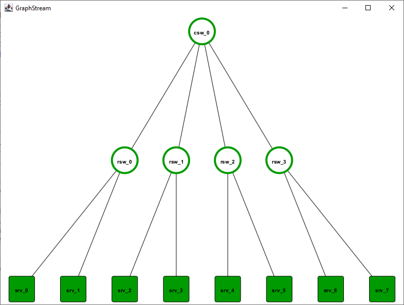

# iflye

**ifyle** is an open-source framework for **I**ncremental **F**ast **L**ightweight (y) virtual network **E**mbedding.


## Installation (development)

* Install [AdoptOpenJDK 16 (HotSpot JVM)](https://adoptopenjdk.net/releases.html?variant=openjdk16&jvmVariant=hotspot) or newer.
* Install eMoflon::IBeX as described [here](https://github.com/eMoflon/emoflon-ibex#how-to-develop).
* Install [Gurobi](https://www.gurobi.com/) in version `9.5.0` and activate a license for your computer.
    * Currently, Gurobi is the default ILP solver used in iflye.
* Install [IBM ILOG CPLEX](https://www.ibm.com/products/ilog-cplex-optimization-studio) in version `20.1`.
    * CPLEX is an alternative ILP solver in iflye. You do not need it explicitely, but if you did not install and configure it properly, at least one test case will fail.
* Launch a runtime workspace (while using a runtime Eclipse) as stated in the eMoflon::IBeX installation steps.
    * Additionally, the runtime workspace needs some environment variables to access the Gurobi and the CPLEX solver. Do not forget to adapt them to your individual setup:
```
GRB_LICENSE_FILE=/home/maxkratz/gruobi.lic
GUROBI_HOME=/opt/gurobi950/linux64/
LD_LIBRARY_PATH=/opt/gurobi950/linux64/lib/
PATH=/opt/gurobi950/linux64/bin/:/opt/ibm/ILOG/CPLEX_Studio128/cplex/bin/x86-64_linux/:$PATH
```
* Clone this Git repository to your local machine and import it into Eclipse: *File -> Import -> General -> Existing Projects into Workspace*. Import all projects.
* Inside the runtime workspace, build all projects (*Project -> Clean... -> Clean all projects*) to trigger code generation.
    * Build the projects *network.model*, *network.model.rules*, *network.model.rules.racka*, *network.model.rules.rackb*, and *network.model.rules.vnet* with the black eMoflon hammer symbol.

A good start point to verify your installation is to run the included unit tests, refer to the [test section](#tests).

### Code-Style

This project uses the built-in code-style and code-formatter of Eclipse.
Before contributing, please set-up your Eclipse code-style settings as follows:

* _Window_ -> _Preferences_ -> _Java_ 
    * -> _Code Style_ -> _Clean Up_ -> _Active profile:_ -> "Eclipse [built-in]" (default)
    * -> _Code Style_ -> _Formatter_ -> _Active profile:_ -> "Eclipse [built-in]" (default)
    * -> _Code Style_ -> _Organize Imports: -> "java, javax, org, com" (default)
    * -> _Editor_ -> _Save Actions:
        * Check "Perform the selected actions on save"
        * Check "Format source code"
        * Check "Format all lines"
        * Check "Organize imports"
        * Check "Additional actions"

By using this settings, you should be unable to commit unformatted code.


## Usage (running simulations)

After finishing the installation steps, you may run simulations, e.g., from the *examples* project.
There are some examples for network generators as well as embedding algorithms.
All examples contain a `public static void main(final String[] args)` method as entry point and can be run as *Java appication* from within the Eclipse workspace.


### CLI usage

You may want to run the whole program as one exported file, e.g., on a server via the CLI for measurement purposes.
To export the whole project as executable JAR file, follow this step:
* *File -> Export... -> Java/Runnable JAR file -> Next -> (Chose your launch configuration) -> (Chose the export destination) -> Library handling: Package required libraries into generated JAR -> Finish*

Depending on your launch configuration, you can start the JAR file with additional arguments.
Example:
`$ java -jar iflye.jar --algorithm taf --objective total-taf-comm --snetfile resources/two-tier-12-pods/snet.json --vnetfile resources/two-tier-12-pods/vnets.json --csvpath metrics.csv`

For larger simulations, you may want to increase the Java heap space.
Example with 32 GiB:
`$ java -Xmx32g -jar iflye.jar $parameters`

In the subfolder [scripts/](scripts/) are some basic Bash scripts to run parameter sweeps as well as CLI argument parsing into the scenario.


### Scenario loader

As this project is the small sibling of the [iDyVE project](https://tubiblio.ulb.tu-darmstadt.de/124918/), you may want to run the same scenarios in both frameworks, e.g., to compare the performance.
For this purpose, **iflye** has a built in model converter which can read virtual and substrate networks from JSON export files (e.g., from iDyVE).

The chosen JSON format is loosly coupled with the used metamodel.
Therefore, it acts as a kind of abstract model representation to transfer models from one metamodel/framework to the other.

Feel free to check out some examples in [vne.scenarios/resources/*/](vne.scenarios/resources/).


## Tests

Various test cases to test the framework as well as some of the implemented VNE algorithms are implemented in the project [test.suite](test.suite/).
To start them, follow this step:
* *Right click on test.suite -> Run As... -> JUnit Test*

Please notice: The test [IlpSolverSetupTest](test.suite/src/test/ilp/IlpSolverSetupTest.java) will check your Gurobi/CPLEX installation and configuration. If this test fails, at least one of the two ILP solvers is not configured properly.


## Visualization

For easier debugging purposes, a basic GUI for visualizing networks is implemented in the project [network.visualization](network.visualization/) based on [GraphViz](http://www.graphviz.org/download/).
Currently, it can render tree-based networks as tree structures or use the automatic mode of GraphViz from a model file `model.xmi` in the [examples project](examples/).
Therefore, launch the class `Ui` with these arguments: `../examples/model.xmi sub 1`
* `../examples/model.xmi` is the path of the model to read.
* `sub` is the name of the (substrate) network to visualize.
* `1` configures the automatic layout. You can also chose `0` to use a tree-like layout.




## License

This project is licensed under the GNU General Public License v3.0 - see the [LICENSE.md](LICENSE.md) file for more details.
